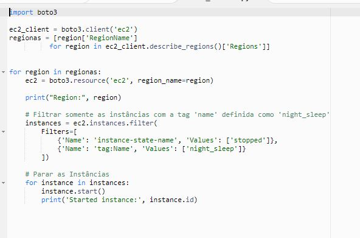
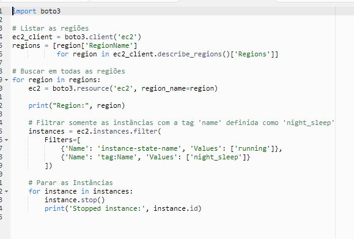
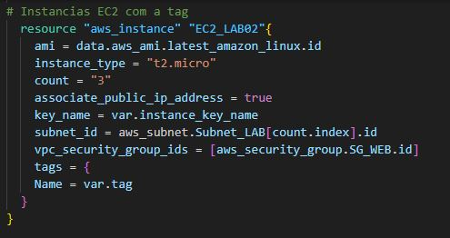
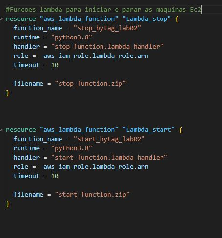
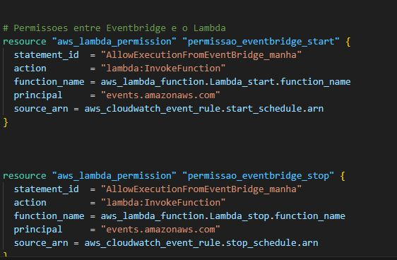
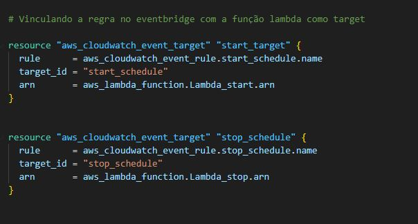
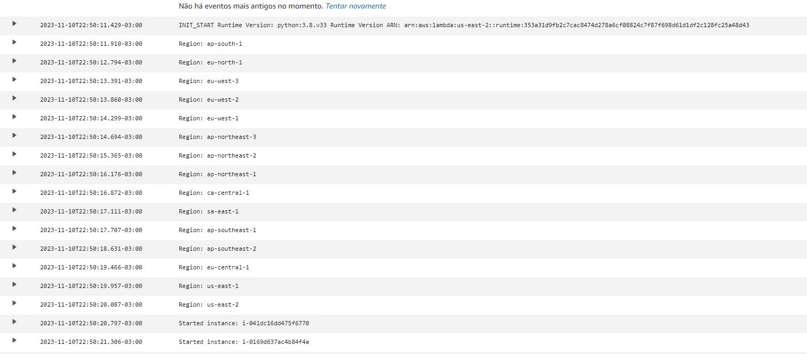
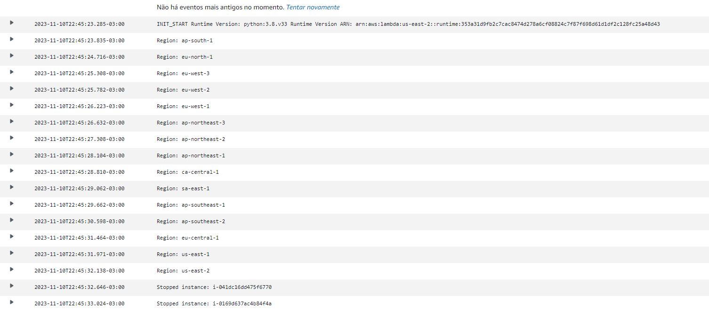

AWS Lambda EventBridge Trigger para Start e Stop de Instâncias EC2
Este laboratório foi desenvolvido para demonstrar como automatizar o início e parada de instâncias EC2 em horários específicos usando funções Lambda acionadas pelo Amazon EventBridge. Os scripts Python utilizam o Framework Boto3 no Lambda com a AWS e as instâncias são identificadas por meio de TAGS. Apenas as instâncias com a tag "night_sleep" serão ligadas e desligadas conforme o cronograma configurado Eventbridge.

# Diagrama

# Scripts em Python usando o Boto3

Script faz um varredura em todas as regioes buscando instancias que estao em Stopped ou Started(Dependendo da funcao) com a tag night_sleep

# Criando três maquinas criadas com a TAG night_sleep

# Funcoes Lambdas para Start e Stop

Funcao lambda com o cdigo python que deve estar como zip

# Criando Schedule 

Criando a regra no Eventbridge com o horario de iniciar e o horario de parar as maquians EC2 via tag

# Permissoes necessarrias entre as Funcooes lambda e o Eventbridge

# Fazendo o trigger entre Lambda e Eventbridge

# Evidencias

Foi necessario alterar os horariosno agendamento da regra para realizar o start e o stop e coletar os logs

Este laboratório oferece uma estrutura eficiente para automatizar a gestão de instâncias EC2 na AWS, proporcionando flexibilidade operacional. Certifique-se de ajustar os horários conforme os requisitos específicos e validar os resultados observados durante a execução do laboratório.